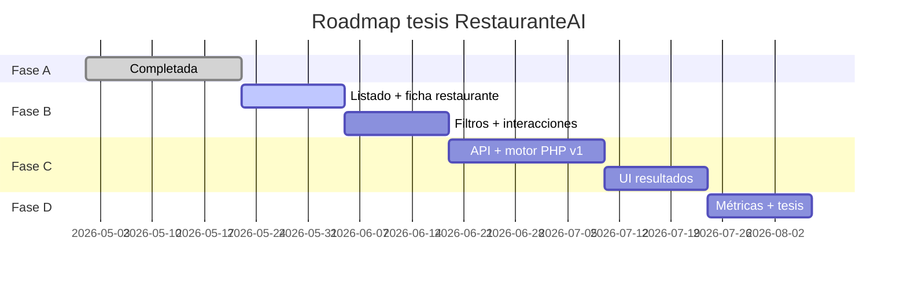

# Roadmap del proyecto — RestauranteAI

> Plataforma de recomendación gastronómica · Lambayeque · USAT 2026  
> Documento vivo: estado actual, brechas respecto a `DATABASE_DESIGN.md` y plan por fases para la tesis.

**Referencias:** [DATABASE_DESIGN.md](./DATABASE_DESIGN.md) · [AI_RECOMMENDATION.md](./AI_RECOMMENDATION.md)

**Última revisión:** mayo 2026 (post-Fase A + cocinas múltiples por restaurante)

---

## Resumen ejecutivo

| Área | Avance aprox. |
|------|----------------|
| Esquema BD + seeders | ~95 % |
| Auth, roles, onboarding dueño/turista | ~88 % |
| Panel super_admin + panel dueño | ~92 % |
| Portal turista + recomendaciones | ~45 % |
| **Proyecto integral (tesis completa)** | **~68 %** |

**Lectura clave:** la **Fase A está cerrada** (backoffice, datos demo, TAM, preferencias ML). El cuello de botella de la tesis sigue siendo el **portal turista con restaurantes reales** y el **motor de recomendación** (Fases B y C).

---

## Estado por fase

| Fase | Estado | Meta |
|------|--------|------|
| **A** — Plataforma operativa | ✅ **Completada** | Backoffice ~95 % |
| **B** — Portal turista (sin ML) | 🟡 **En curso** (~45 %) | Turista ~60 % |
| **C** — Motor de recomendación | ⏳ Pendiente | Visión ML ~75–80 % |
| **D** — Investigación / tesis | ⏳ Pendiente | Métricas + CRISP-DM |

---

## Lo que ya se hizo

### Base de datos y modelos

- [x] Geografía: `departments`, `provinces`, `districts` + seeder INEI Lambayeque.
- [x] Catálogos: `cuisine_types`, `ambiances`, `services`, `dish_categories`, `support_languages`.
- [x] Negocio: `restaurants`, imágenes, horarios, pivots `restaurant_service`, `restaurant_language`.
- [x] **Cocinas múltiples por restaurante:** pivote `restaurant_cuisine_type` (`is_primary`) + `cuisine_type_id` como cocina principal (sync automático).
- [x] Carta y promociones: `dishes`, `promotions`.
- [x] Reseñas: `reviews`.
- [x] ML (estructura): `user_interactions`, `recommendation_requests`, `recommendations`.
- [x] **`user_preferences`** (migración + modelo + servicio).
- [x] **`tam_surveys`** ampliada (10 ítems Likert + comentario).
- [x] Perfiles: `restaurant_profiles`, `tourist_profiles`, `social_accounts`, permisos Spatie.

### Fase A — entregables (mayo 2026)

- [x] **A.1** Tabla `user_preferences` + `UserPreferenceService` + formulario en `/explore/profile`.
- [x] **A.2** Encuesta TAM en `/explore/tam-survey` (una encuesta por turista).
- [x] **A.3** `LambayequeGeographySeeder`, `DemoRestaurantSeeder`, `CleanupPhantomDataSeeder`.
- [x] **A.4** Tests: catálogos, preferencias/TAM, platos dueño, hub admin, sync cocinas múltiples.

### Autenticación y roles

- [x] Fortify, OAuth Google, 2FA, settings.
- [x] Roles `super_admin`, `restaurant_owner`, `tourist`.
- [x] Onboarding dueño (aprobación) y turista (setup + explore).

### Panel super_admin

- [x] Dashboard, usuarios, roles, geografía, catálogos.
- [x] Restaurantes + hub; gestión scoped por local.
- [x] Reseñas/analytics globales; datos ML solo lectura.
- [x] Suplantación dueño **solo lectura**.
- [x] CRUD restaurantes con **varias cocinas** (chips + ★ principal).

### Panel dueño

- [x] Perfil del local con **selector múltiple de cocinas** (`CuisineTypeMultiSelect`).
- [x] Horarios, galería, servicios, idiomas, platos, promos, reseñas, analytics.
- [x] `useOwnerReadOnly()` + banner suplantación.

### Portal turista (parcial → B en curso)

- [x] Layout móvil `TouristExploreLayout` (nav inferior: Explorar · Rutas · Perfil).
- [x] `/explore` discover: listado + mapa (Leaflet/OSM), filtros por cocina, datos reales.
- [x] `/explore/restaurants/{slug}` — ficha con cocinas múltiples, platos, “Cómo llegar”.
- [x] **Rutas turísticas:** borrador, agregar/quitar paradas (+), publicar, mapa con polyline y paradas numeradas.
- [x] `/explore/routes` — listado; `/explore/routes/{slug}` — seguir ruta + Google Maps.
- [x] `/explore/profile` y `/explore/tam-survey`.
- [ ] Búsqueda avanzada (precio, distrito) y favoritos.
- [ ] `user_interactions` y reseñas turista (B.3–B.4).
- [ ] Recomendaciones ML (Fase C).

### Credenciales de prueba

| Rol | Email | Contraseña |
|-----|-------|------------|
| Super admin | `admin@restauranteai.com` | `Admin1234!` |
| Dueño demo | `dueno@restauranteai.com` | `Demo1234!` |
| Turista demo | `turista@restauranteai.com` | `Tourist1234!` |

**Demo:** 3 restaurantes activos/verificados en Chiclayo; *La Casona Criolla* con cocinas **Criolla + Ceviche**.

```powershell
php artisan migrate
php artisan db:seed --class=LambayequeGeographySeeder
php artisan db:seed --class=DemoRestaurantSeeder
```

---

## Lo que falta (brechas vs diseño)

### Base de datos

| Elemento | Estado | Notas |
|----------|--------|--------|
| `restaurant_owners_profiles` | ⚠️ Sustituida | Se usa `restaurant_profiles`. |
| Observer `reviews` → `avg_rating` | ❌ | Pendiente Fase B.4. |
| Doc. `DATABASE_DESIGN.md` | ⚠️ | Actualizar diagrama: pivote `restaurant_cuisine_type` (varias cocinas). |

### Portal turista (prioridad tesis)

| Flujo | Estado |
|-------|--------|
| Listado restaurantes activos/verificados | ✅ B.1 |
| Ficha detalle (fotos, platos, cocinas múltiples) | ✅ B.1 (horarios en siguiente iteración) |
| Rutas turísticas con mapa | ✅ B.1+ |
| Búsqueda/filtros con catálogos reales | ❌ Fase B.2 |
| `user_interactions` al navegar | ❌ Fase B.3 |
| Turista `write_reviews` | ❌ Fase B.4 |
| Recomendaciones + API ML | ❌ Fase C |

### Motor de recomendación

- [ ] `POST /explore/recommend` → `recommendation_requests` + `recommendations`.
- [ ] Motor PHP v1 (contenido + contexto + horario; usar **todas** las cocinas del restaurante en el match).
- [ ] UI explore sin “Próximamente”.
- [ ] Python/FastAPI (opcional).

### Investigación (Fase D)

- [ ] Métricas precisión@k, cobertura.
- [ ] Análisis encuestas TAM recolectadas.
- [ ] CRISP-DM + comparación de algoritmos.

---

## Porcentaje por pilar

```
Backoffice (admin + dueño)     █████████████████████░  ~92 %
Esquema BD + seeders           ████████████████████░░  ~95 %
Portal turista                 ██████░░░░░░░░░░░░░░░░  ~32 %
ML + recomendaciones           █░░░░░░░░░░░░░░░░░░░░░   ~5 %
─────────────────────────────────────────────────────────
Proyecto tesis (integral)      █████████████░░░░░░░░░  ~62–65 %
```

---

## Plan por fases

### Fase A — Cerrar plataforma operativa ✅ COMPLETADA

**Meta:** backoffice ~95 % — **alcanzada.**

| # | Tarea | Estado |
|---|--------|--------|
| A.1 | `user_preferences` | ✅ |
| A.2 | TAM en explore | ✅ |
| A.3 | Seeders Lambayeque + demo + limpieza fantasma | ✅ |
| A.4 | Tests humo admin/dueño/catálogos/TAM/cocinas | ✅ |
| A+ | Cocinas múltiples por restaurante (pivote + UI) | ✅ |

---

### Fase B — Portal turista (sin ML aún) 🔜 SIGUIENTE

**Duración estimada:** 3–4 semanas  
**Meta:** portal turista ~60 %

| # | Tarea | Entregable | Prioridad |
|---|--------|------------|-----------|
| **B.1** | **Listado + ficha restaurante** | `/explore/restaurants`, `/explore/restaurants/{slug}`; BD; badges de **todas** las cocinas | 🔴 Alta |
| **B.2** | Búsqueda y filtros | Por cocina(s), precio, distrito; quitar categorías mock en React | 🔴 Alta |
| **B.3** | `user_interactions` | Registrar `view`, `search`, `favorite` | 🟠 Media |
| **B.4** | Reseñas turista | `write_reviews` + Observer `avg_rating` | 🟠 Media |
| **B.5** | Preferencias ML en flujo explore | Ya en perfil (A.1); enlazar con listado/filtros | 🟢 Baja (casi hecho) |

**MVP opcional (fin de B):** recomendación por reglas en PHP (filtro por cocinas del restaurante, precio, horario abierto).

**Criterio de cierre:** turista busca, ve ficha con varias cocinas, favorita y reseña; datos listos para ML.

---

### Fase C — Motor de recomendación

**Duración estimada:** 4–6 semanas · **Meta:** ~75–80 % visión ML

| # | Tarea |
|---|--------|
| C.1 | API `POST /explore/recommend` |
| C.2 | Motor híbrido v1 en PHP (match multi-cocina + contexto) |
| C.3 | Microservicio Python (opcional) |
| C.4 | UI resultados (scores, mapa) |
| C.5 | Admin: depuración de interacciones/solicitudes |

---

### Fase D — Investigación / tesis

| # | Tarea |
|---|--------|
| D.1 | Métricas offline |
| D.2 | Análisis TAM (`tam_surveys`) |
| D.3 | Documentación CRISP-DM |
| D.4 | Comparación algoritmos (`algorithm_used`) |

---

## Orden recomendado (cronograma)



**Secuencia mínima para la defensa:**

1. **B.1 + B.2** — explore con restaurantes reales y filtros.  
2. **B.3 + B.4** — interacciones y reseñas.  
3. **C.1 + C.2** — recomendación PHP (multi-cocina en el score de contenido).  
4. **D.1 + D.2** — métricas y análisis TAM (encuestas ya se recolectan).  
5. **C.3** Python solo si hay tiempo.

---

## Próximo paso inmediato → Fase B.2–B.4

Completar **filtros** (precio, distrito), **`user_interactions`**, **reseñas turista** y horarios “abierto ahora” en ficha.

**Backend**

- `ExploreRestaurantController` o ampliar `ExploreController`.
- Rutas: `GET /explore/restaurants`, `GET /explore/restaurants/{restaurant:slug}`.
- Query: `is_active`, `is_verified`, `with(['cuisineTypes', 'district', 'images', 'schedules'])`.
- Mostrar **todas** las cocinas (★ en la principal).

**Frontend**

- `resources/js/pages/explore/restaurants/index.tsx` — grid de tarjetas.
- `resources/js/pages/explore/restaurants/show.tsx` — ficha completa.
- Sustituir bloque “Próximamente” o enlazar desde categorías reales (`cuisine_types`).

**Archivos clave**

- `routes/web.php`
- `app/Http/Controllers/ExploreController.php` (o nuevo controlador)
- `resources/js/pages/explore/`
- Reutilizar badges de cocina como en admin/hub.

---

## Checklist rápido

### Fase A ✅
- [x] A.1 `user_preferences`
- [x] A.2 TAM explore
- [x] A.3 Seeders + limpieza
- [x] A.4 Tests humo
- [x] Cocinas múltiples (`restaurant_cuisine_type`)

### Fase B 🟡
- [x] B.1 Listado + ficha + rutas con mapa
- [ ] B.2 Búsqueda y filtros (precio/distrito)
- [ ] B.3 Interacciones
- [ ] B.4 Reseñas turista + Observer
- [x] B.5 Preferencias ML (perfil explore — hecho en A.1)

### Fase C
- [ ] C.1 API `/explore/recommend`
- [ ] C.2 Motor PHP v1
- [ ] C.3 Python (opcional)
- [ ] C.4 UI resultados
- [ ] C.5 Admin depuración

### Fase D
- [ ] D.1 Métricas
- [ ] D.2 Análisis TAM
- [ ] D.3 CRISP-DM
- [ ] D.4 Comparación algoritmos

---

## Notas de arquitectura

- **Cocinas:** relación N:N `restaurant_cuisine_type`; `restaurants.cuisine_type_id` = cocina **principal** (sincronizada por `RestaurantCuisineService`).
- **Separación admin/dueño:** estable; no reabrir salvo módulos globales nuevos.
- **Suplantación:** solo lectura para `super_admin` en rutas dueño.
- **ML:** al recomendar, considerar **todas** las `cuisineTypes` del restaurante, no solo la principal.
- **Perfiles:** `restaurant_profiles` ≡ `restaurant_owners_profiles` del PDF de tesis.

---

*Actualizar este archivo al cerrar B.1, B.2, etc.*
